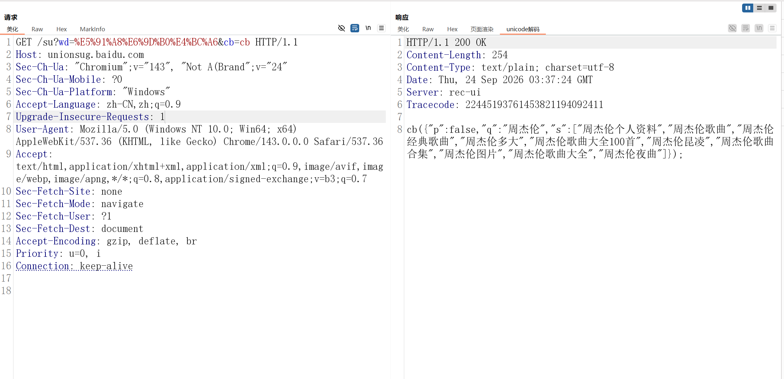

# Burp Suite Unicode解码插件

一个Burp Suite扩展插件，在响应视图中新增“unicode解码”标签，基于Burp原生编辑器展示完整解码后的报文，适用于Proxy、Repeater等模块。

## 功能
- 复用 Burp 原生响应编辑器（只读），保留语法高亮与行号，字体、主题等设置自动跟随 Burp
- 标签页内无内嵌标题栏，直接展示与 Raw 视图一致的完整报文（状态行 + 响应头 + 响应体）
- 将响应体中所有Unicode编码（`\uXXXX`格式）原地解码为中文，按报文声明的字符集处理，非UTF-8响应不乱码
- 响应中无Unicode编码时原样展示报文
- 标签页内支持文本选取并透传给 Burp（右键“发送到”等操作可用）



*左侧为对快速测试接口的请求，右侧「unicode解码」标签中展示解码后的完整响应（语法高亮、行号跟随Burp原生样式）*

## 环境要求
- JDK 21 及以上
- 支持 Montoya API 的新版 Burp Suite

## 构建
```bash
mvn clean package
```
构建产物位于 `target/UnicodeDecodeViewer-1.0.0.jar`。

## 安装
1. Burp Suite → Extensions → Add
2. Extension Type 选择 Java
3. Extension File 选择构建出的 `UnicodeDecodeViewer-1.0.0.jar`
4. 加载后，任意 HTTP 响应的视图标签栏会出现“unicode解码”标签

## 快速测试
访问以下接口，响应体中包含大量 `\uXXXX` 形式的中文，可在「unicode解码」标签查看解码效果：

```
https://unionsug.baidu.com/su?wd=%E5%91%A8%E6%9D%B0%E4%BC%A6&cb=cb
```

原始响应（节选）：
```
cb({"p":false,"q":"\u5468\u6770\u4f26","s":["\u5468\u6770\u4f26\u4e2a\u4eba\u8d44\u6599","\u5468\u6770\u4f26\u6b4c\u66f2",...
```

解码后：
```
cb({"p":false,"q":"周杰伦","s":["周杰伦个人资料","周杰伦歌曲",...
```

`wd` 参数可替换为任意中文关键词（URL编码后传入）。

## License
[MIT](LICENSE)
